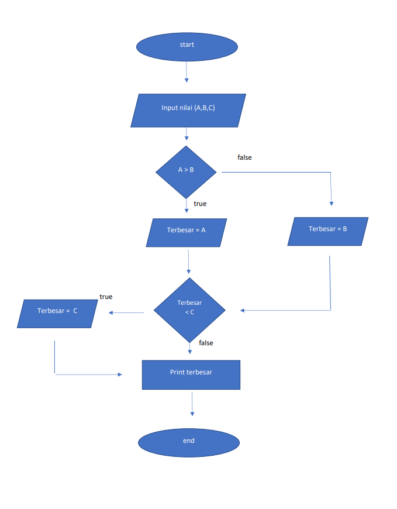
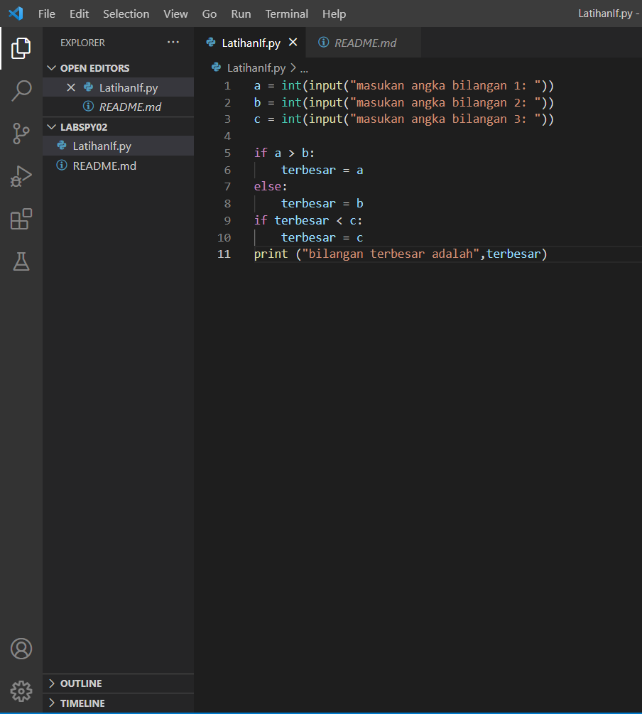
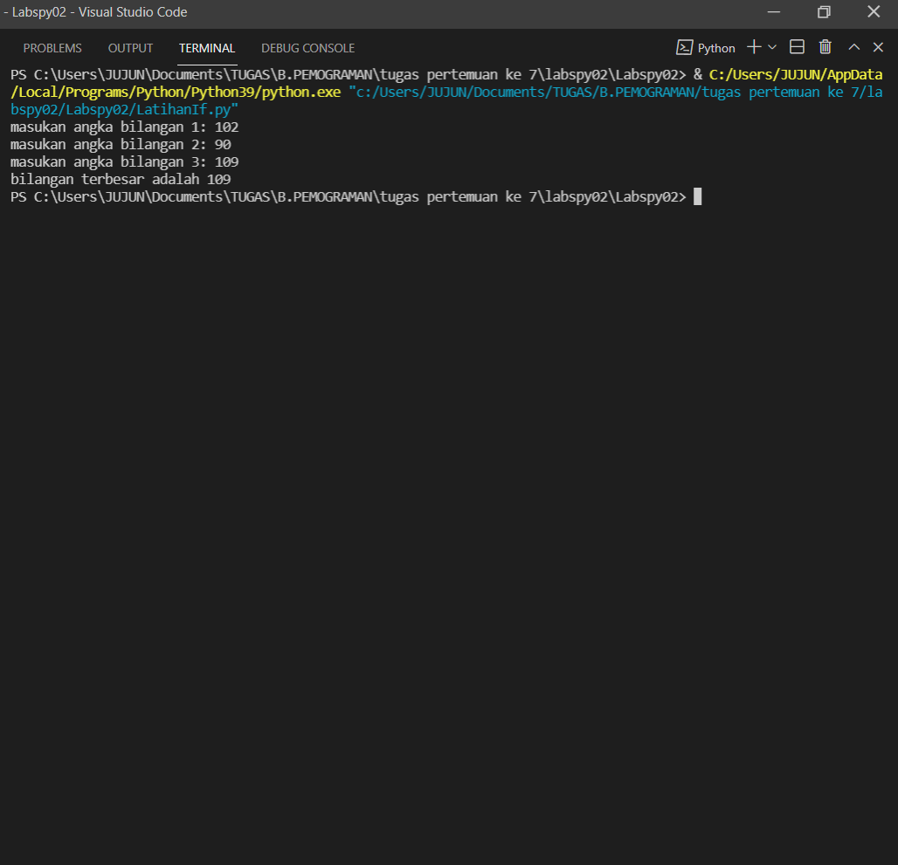

# Labspy02
# Program sederhana mencari bilangan terbesar dengan cara menginput 3 bilangan dan menggunakan if

# A.Flow Chart

# B. Program

# C. Hasil Program

# D. Penjelasan Program 
Algoritmanya membandingkan 2 buah variabel terlebih dulu, yaitu a dan b. Nilai terbesar dari a dan b akan disimpan dalam variabel maks. Berikutnya variabel maks akan dibandingkan dengan c. Jika nilai maks lebih kecil dari c, maka nilai maks diubah menjadi c. Dengan demikian, nilai variabel maks adalah nilai yang terbesar dari a, b dan c.